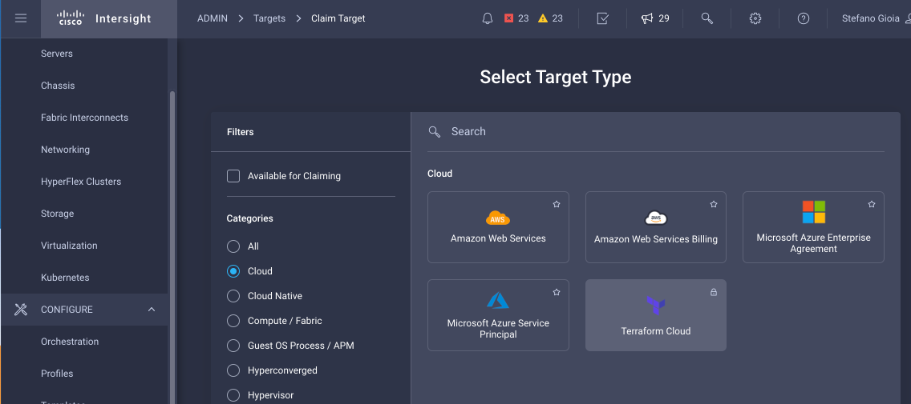
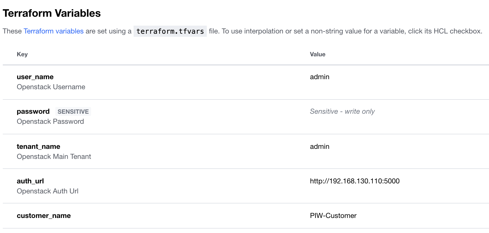
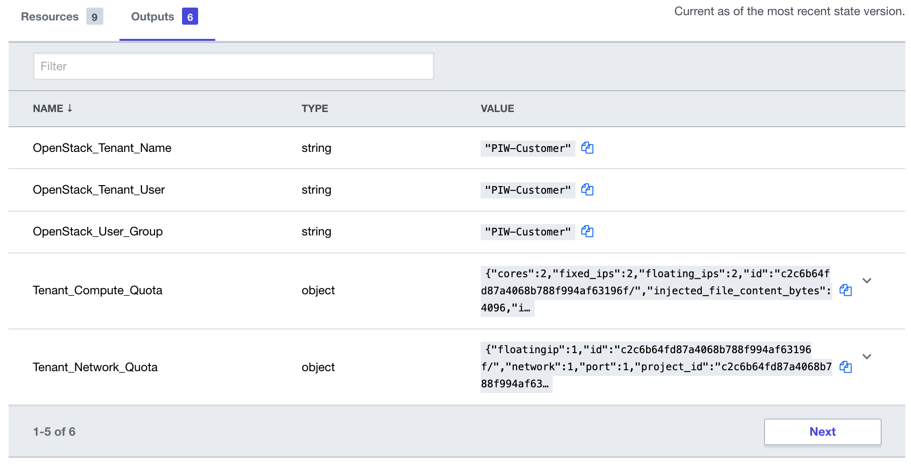

# Provisioning a new tenant in Onepstack 
## Overview

Cisco Intersight Service for HashiCorp Terraform (IST) addresses the challenge of securely connecting and configuring on-premises and hybrid environments to work with Terraform Cloud Business Tier. Leveraging Intersight Assist, users can integrate Terraform Cloud Business with Cisco Intersight, enabling secure communication between on-premises data centers and edge locations with the IaC platform. This means users can spend less time managing the end-to-end lifecycle of Terraform Cloud Agents, benefiting from native integration directly within Intersight, including upgrades and the ability to scale as demand grows.

This example covers a simple use case to create a new project/tenant in Openstack alongside users, quota, and policies for a new customer. This use case will walk the user through the following steps:

1.  Adding your Terraform Cloud for Business Tier Credentials
2.  Adding your Terraform Cloud Agent
3.  Executing Terraform Code to create the new tenant in Openstack


The code will get all the required inputs from the Terraform Cloud workspace. As an example, to create the project/tenant, we refer to the variable "tenant-name", as shown in the code below:

```
// Create a project
resource "openstack_identity_project_v3" "myProject" {
  name        = var.customer_name
  description = "A project dedicated to ${var.customer_name}"
}
```

As of today, the terraform plan use fixed information to create the quota and other stuff, but it will be very simple to transform this fixed value in variable. 

## Requirements

1.	Intersight SaaS platform account with Advantage licenses
2.	An Intersight Assist appliance that is connected to your Intersight environment
3.	Terraform Cloud Business Tier Account
4.  An exhisting Openstack private cloud system
5.	Openstack Administration Access: username, password and endpoint url
6.	GitHub account to host your Terraform code
7.  A workspace in Terraform Cloud 


## Steps to Deploy Use Case


### Setup Terraform Cloud Business Tier Account

To add your Terraform Cloud credentials in Intersight you will need the following:
1. Terraform Cloud Username
2. Terraform Cloud API Token
3. Terraform Cloud Organization

Login to Intersight and claim your Terraform Cloud target.
Go to Admin/Targets/ClaimTarget and select Terraform Cloud.



Fill the form by providing the necessary information:
 - Terraform Cloud Uswername
 - Terraform Cloud API Token
 - Default Terraform Cloud Organizations
 - Default managed host (comma-separated list of endpoints that the Terraform Agent will configure (e.g., github.com, amazonaws.com etc.)

### Claim Terraform Agent

Once the target is created, the agent can be added. 

### Create GitHub Repo

1. Go to https://github.com/CiscoDevNet/openstack-provisioning
2. Fork it into your own GitHub account

### Create Workspace in Terraform Cloud

1. Create a new workspace and choose a version control provider (setup in the previous step) that hosts the Terraform configuration for this workspace. 
2. Go to the Variables section and add the following variables with the value specific to your environment (the values provided below are examples)

| Key                |   Value          | Type         | Description |
|--------------------|------------------|--------------|-------------|
| auth_url | http://192.168.130.110:5000|String| The Openstack administration endpoint
| user_name | admin|String | The Openstack administration user 
| password | ******** | String, Sensitive | The password of the Openstack administrator user
| tenant_name | RMLAB | String| Openstack main tenant
| customer_name | RMLAB |String| The Customer's name used to create tenant, users and role


 


### Execute Deployment

To execute the Terraform code in your datacenter click on the ***Queue Plan Manually*** button

## Results

You will see the tenant's name alongside the customer name, user's group, and all the quotas associated with the tenant.
The following output will be generated:
   

## Related Sandbox

Get hands on experience with Intersight Service for Terraform in DevNet's Sandbox environment.

[Cisco Intersight Service for HashiCorp Terraform](https://devnetsandbox.cisco.com/RM/Diagram/Index/055e2dce-fdfd-4d26-a112-72b884ddd7c7?diagramType=Topology)

## Links to DevNet Learning Labs

Learn how to provision virtual machines in vSphere using Intersight Service for Terraform.

[Introduction to Intersight Service for Hashicorp Terraform](https://developer.cisco.com/learning/lab/intersight-01-ist-introduction/step/1)
[Provisioning VMs using Intersight Terraform Service for Hashicorp](https://developer.cisco.com/learning/lab/intersight-02-ist-vm-automation/step/1)